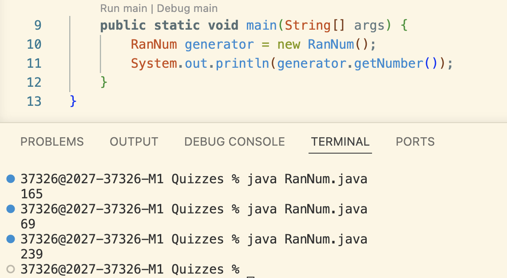
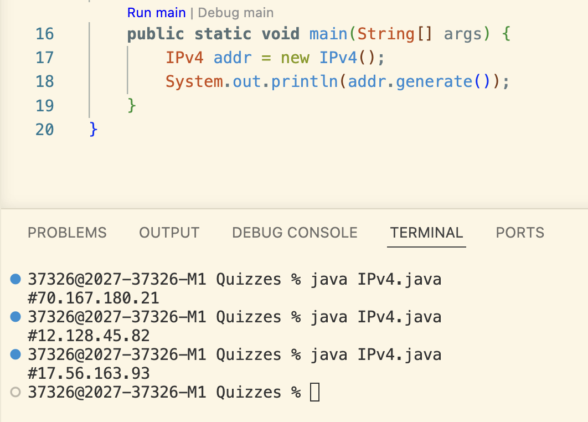
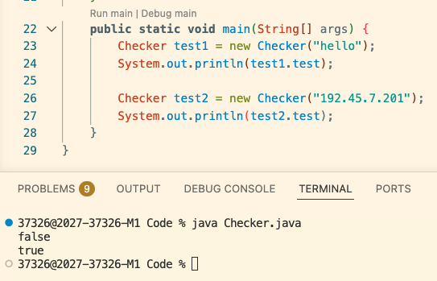

Quizzes Doc ->

Quiz 1 - 13/08/2026

Prompt: Create a class that generates a random number between 0 and 256, returns a string.

Code Solution: 
```
public class RanNum {
    public String getNumber() {
        int num = (int) (Math.random() * 257);
        return num + "";
    }
```

Screenshot Proof:



Quiz 2 - 18/08/2026

Prompt: Create a class that generates a valid IPv4 address. You may use the class RanNum()

Code Solution:
``` 
public class IPv4 {
    public String generate() {
        String string = "#";
        for (int i = 0 ; i < 4; i++) {
            RanNum num = new RanNum();
            if (i == 3) {
                string = string + num.getNumber();
            } else {
                string = string + num.getNumber() + ".";
            }  
        }
        return string;
    }
```

Screenshot Proof:



Quiz 3 - 20/08/2026

Prompt: Create a class that receives a input String add and it checks for valid IPv4 address.

Code Solution:
```
public class Checker {
    Boolean test = true;
    public Checker(String add) {
        String[] pieces = add.split("\\.");

        if (pieces.length != 4) {
            test = false;
        } else {
            for (int i = 0; i < pieces.length; i++) {
                try {
                    int num = Integer.parseInt(pieces[i]);
                    if (num < 0 || num > 255) {
                        test = false;
                    }
                } catch(Exception NumberFormatException) {
                    test = false;
                }
            }
        }
    }
```
Screenshot Proof:
