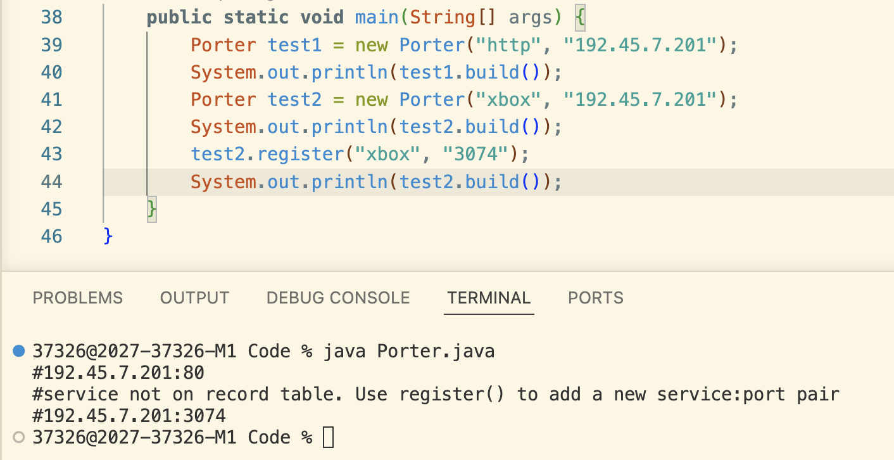

# Quizzes for IB Y2

## Quiz 1 - 13/08/2026

### Prompt: 
Create a class that generates a random number between 0 and 256, returns a string.

### Code Solution: 
```java
public class RanNum {
    public String getNumber() {
        int num = (int) (Math.random() * 257);
        return num + "";
    }
```

### Screenshot Proof:


## Quiz 2 - 18/08/2026

### Prompt: 
Create a class that generates a valid IPv4 address. You may use the class RanNum()

### Code Solution:
```java
public class IPv4 {
    public String generate() {
        String string = "#";
        for (int i = 0 ; i < 4; i++) {
            RanNum num = new RanNum();
            if (i == 3) {
                string = string + num.getNumber();
            } else {
                string = string + num.getNumber() + ".";
            }  
        }
        return string;
    }
```

### Screenshot Proof:


## Quiz 3 - 20/08/2026

### Prompt: 
Create a class that receives a input String add and it checks for valid IPv4 address.

### Code Solution:
```java
public class Checker {
    Boolean test = true;
    public Checker(String add) {
        String[] pieces = add.split("\\.");

        if (pieces.length != 4) {
            test = false;
        } else {
            for (int i = 0; i < pieces.length; i++) {
                try {
                    int num = Integer.parseInt(pieces[i]);
                    if (num < 0 || num > 255) {
                        test = false;
                    }
                } catch(Exception NumberFormatException) {
                    test = false;
                }
            }
        }
    }
```
### Screenshot Proof:  


## Quiz 4 - 21/08/2026

### Prompt:
Create a class receives a service name, ip address and build a ip:port address.

### Code Solution:
```java
public class Porter {
    ArrayList<String> service = new ArrayList<>();
    ArrayList<String> port = new ArrayList<>();
    String serviceName;
    String ip;
    String portNum;

    public Porter(String serviceName, String ip) {
        this.serviceName = serviceName;
        this.ip = ip;
        service.add("http"); service.add("https"); service.add("playstation"); service.add("ssh"); service.add("ftp"); service.add("mysql");
        port.add("80"); port.add("443"); port.add("3479"); port.add("22"); port.add("20"); port.add("3306");
    }

    public String build() {
        for (int i = 0; i < service.size(); i++) {
            if (serviceName.equals(service.get(i))) {
                portNum = port.get(i);
                break;
            } else {
                portNum = "-1";
            }
        }
        
        if (portNum.equals("-1")) {
            return "#service not on record table. Use register() to add a new service:port pair";
        } else {
            return "#" + ip + ":" + portNum;
        }
    }

    public void register(String service, String port) {
        this.service.add(service);
        this.port.add(port);
    }
}
```

### Screenshot Proof:
